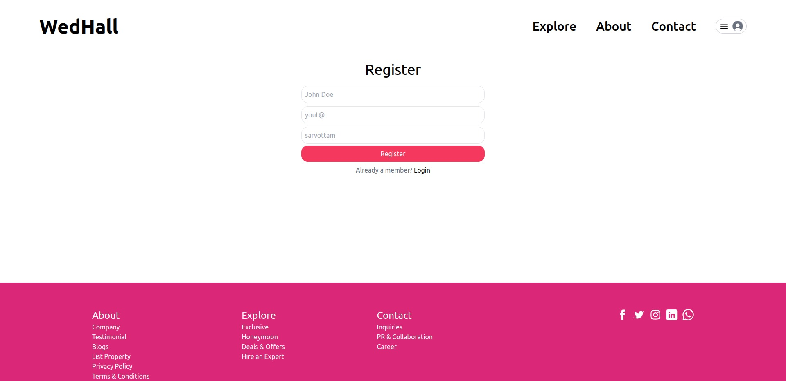
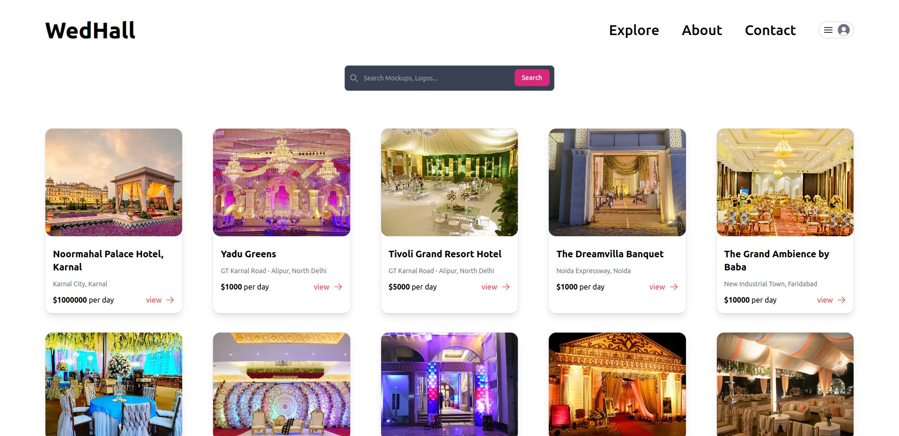
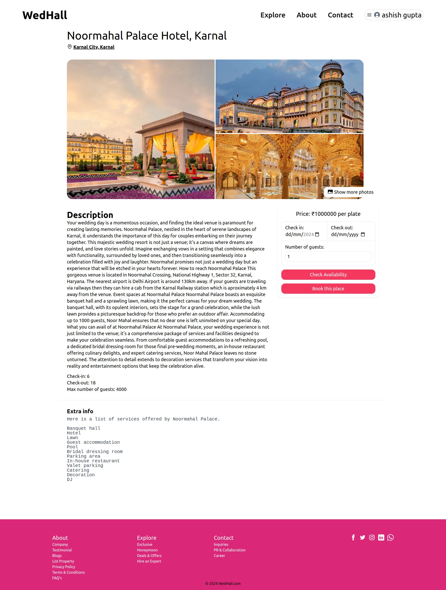
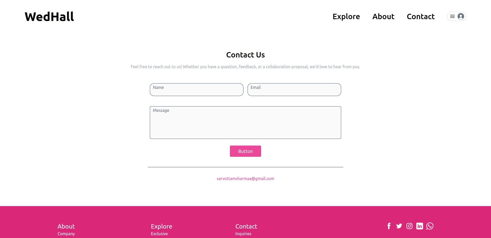

# Hall Booking System

A full stack MERN (MongoDB, Express.js, React.js, Node.js) project for managing and booking halls. This application allows users to search for available halls, make bookings, and manage their reservations.

## Features

- User authentication and authorization
- Search for available halls based on date and time
- Book, cancel, and manage reservations
- Responsive design for mobile and desktop

## Tech Stack

- **Frontend**: React.js, tailwind
- **Backend**: Node.js, Express.js
- **Database**: MongoDB
- **Authentication**: JWT (JSON Web Tokens)

 
 
 
 
 

